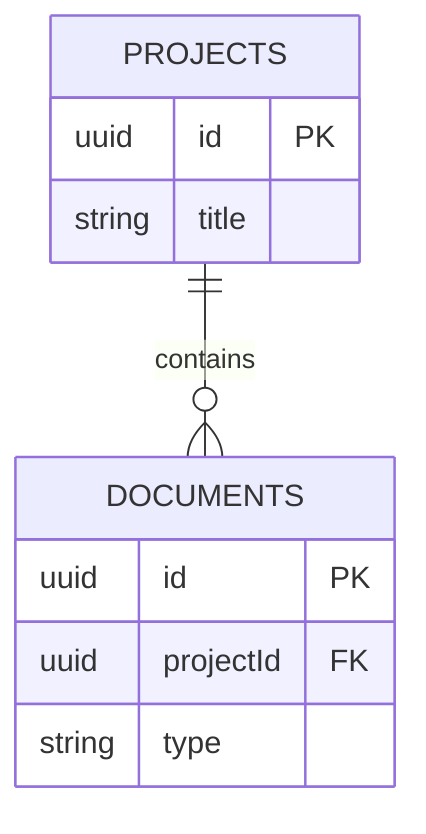

# Blueprint Specification — TestProject

> **Project Dossier:** Complete Architectural & Functional Blueprint  
> **Documents Included:** 5  
> **Export Date:** 5/10/2026

## Table of Contents

1. [Business Requirements Document — Business Requirements Document](#brd-business-requirements-document)
2. [Software Requirements Specification — Software Requirements Specification](#srs-software-requirements-specification)
3. [User Stories — User Stories](#userstories-user-stories)
4. [REST API Design — REST API Design](#apispec-rest-api-design)
5. [Database Schema — Database Schema](#dbschema-database-schema)

---

# Business Requirements Document

> **Document Type:** Business Requirements Document  
> **Project:** TestProject  
> **Version:** V1  
> **Generated / Updated:** 5/10/2026

---

## Executive Summary

BlueprintAI streamlines AI-powered specification workflows.

## Business Problem

Manual requirements authoring is slow and inconsistent.

## Business Objectives

- Reduce authoring time by 70%
- Standardize team artifacts

## Project Scope

- [In Scope] BRD generation
- [In Scope] SRS generation
- [In Scope] Export to PDF/MD
- [Out of Scope] Automated code deployment

## Stakeholders

| Role | Description |
| --- | --- |
| Product Manager | Defines vision and scope |
| Engineering Lead | Validates technical feasibility |

## Business Requirements

| ID | Title | Priority | Description |
| --- | --- | --- | --- |
| BR-1 | Export Docs | High | Export to Markdown and PDF |

---

# Software Requirements Specification

> **Document Type:** Software Requirements Specification  
> **Project:** TestProject  
> **Version:** V1  
> **Generated / Updated:** 5/10/2026

---

## 1. System Overview

BlueprintAI is a microservice-ready Node.js & React platform.

## 3. Functional Requirements

| ID | Category | Title | Priority | Description |
| --- | --- | --- | --- | --- |
| FR-1 | — | Auth Service | High | JWT cookie-based auth |

## 4. Non-Functional Requirements

| Category | Requirement | Metric / SLA |
| --- | --- | --- |
| Security | All endpoints protected with helmet & JWT | Target SLA |

---

# User Stories

> **Document Type:** User Stories  
> **Project:** TestProject  
> **Version:** V1  
> **Generated / Updated:** 5/10/2026

---

## User Story Cards

### [US-01] Export to PDF
*Priority / Status: High*  

**Acceptance Criteria / Details:**
- Given a completed document, when I click export PDF, then it downloads cleanly.

---

# REST API Design

> **Document Type:** REST API Design  
> **Project:** TestProject  
> **Version:** V1  
> **Generated / Updated:** 5/10/2026

---

## API Overview & Base URL

**Base URL:** `/api/v1`

## Resource Group: Endpoints

### GET /api/projects/:projectId/export
*Priority / Status: Public*  
Read-only stream endpoint supporting single or all document exports.  

Read-only stream endpoint supporting single or all document exports.

---

# Database Schema

> **Document Type:** Database Schema  
> **Project:** TestProject  
> **Version:** V1  
> **Generated / Updated:** 5/10/2026

---

## Database Entities & Schemas

### Table: documents
Stores generated specification documents  

| Field | Type | Constraints |
| --- | --- | --- |
| id | UUID | PK, Required |
| projectId | UUID | Required |
| type | VARCHAR(50) | Required |
| status | VARCHAR(20) | Required |

**Acceptance Criteria / Details:**
- Relationship: N:1 → projects (projectId)

## Entity Relationship Diagram & Schema Definition

