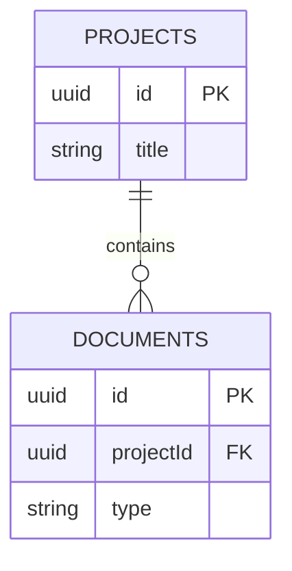

# Database Schema

> **Document Type:** Database Schema  
> **Project:** TestProject  
> **Version:** V1  
> **Generated / Updated:** 5/10/2026

---

## Database Entities & Schemas

### Table: documents
Stores generated specification documents  

| Field | Type | Constraints |
| --- | --- | --- |
| id | UUID | PK, Required |
| projectId | UUID | Required |
| type | VARCHAR(50) | Required |
| status | VARCHAR(20) | Required |

**Acceptance Criteria / Details:**
- Relationship: N:1 → projects (projectId)

## Entity Relationship Diagram & Schema Definition

